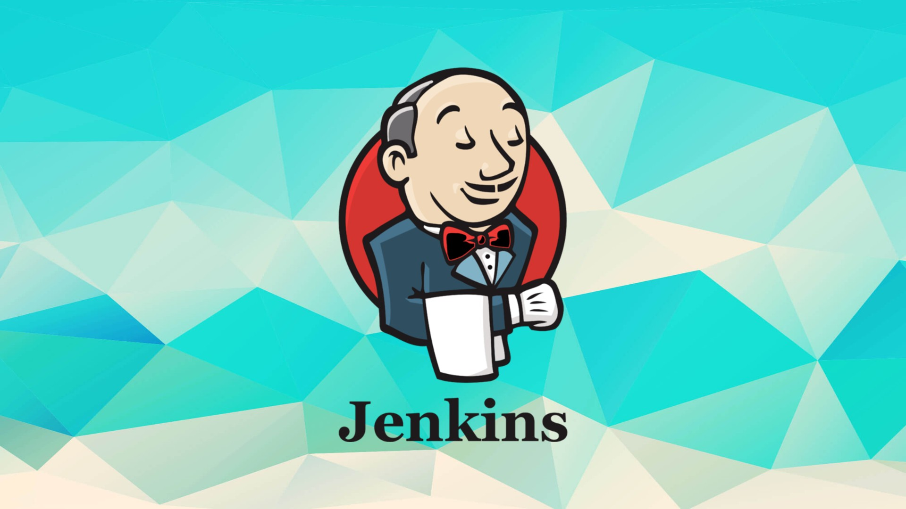

# Playground



Repository with the purpose of learning and playing around with Jenkins, Kubernetes and other tools.

## Requirements

- Java OpenJDK 17
- Docker (optional)

## Build and run

This approach uses Java to run the Jenkins server, so you need to have Java installed on your machine.
```bash
make
```

To run with Docker, you need to have Docker installed on your machine.
```bash
make exec-docker
```

## Others

Anything automation related is on the `Makefile`
Jobs are on the `jobs` folder
Docker images are on the `docker` folder
There is a outside app linked with a submodule on the `app` folder
Logs are being store but ignored on the `logs` folder